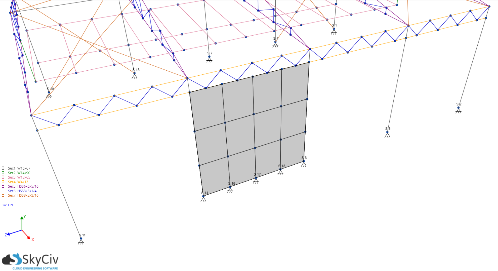
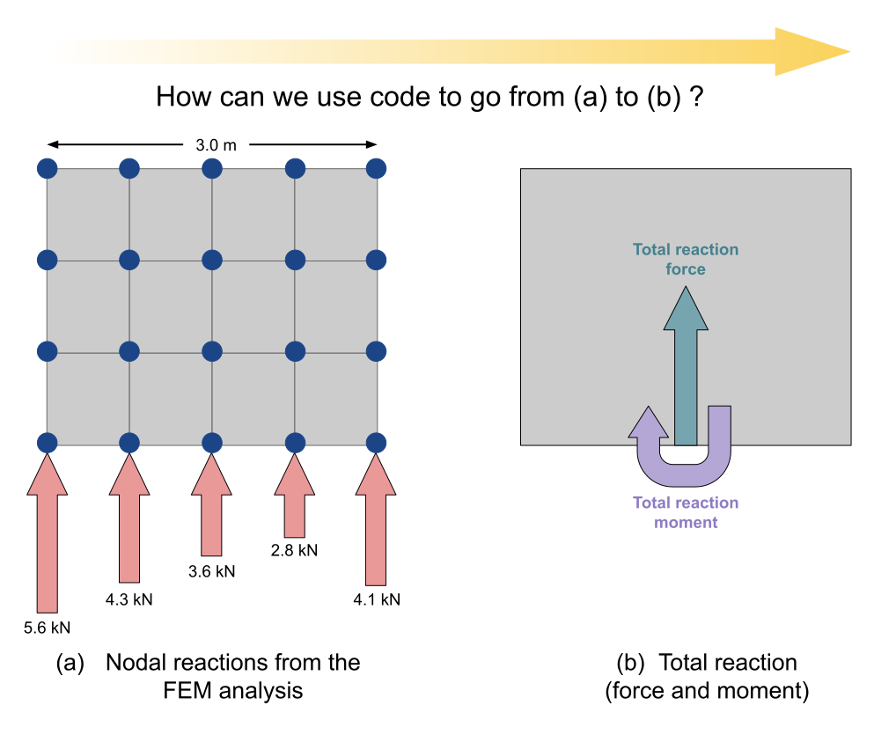

# Our Engineering problem

Throughout this course we will be learning our programming concepts in reference to a simple engineering problem that we want to solve.

For this purpose, let's say we have a meshed wall in a 3D structural analysis model. Here is the meshed wall in _SkyCiv Structural 3D_:



We can see that it comprises 12 elements and 20 nodes, 5 of which are supported.

In _Structural 3D_ we can look at the reactions at these supports individually, but what if we wanted to know the total reaction at the base of the wall, in the center?

For a single wall, it's easy - we just add up the reactions by hand, and that gives us the total force. We can also multiply each force, by its distance from where we want to calculate the moment, add those up, and that gives us the total moment.

Now consider that we have a much larger model, with many more walls. What's wrong with this manual process?

(i)     Open to human error<br>
(ii)    Repetitive and time consuming<br>
(iii)   Boring<br>
(iv)    Not really Engineering (just doing sums)<br>

>This might not be a calculation you personally need to do, but it's indicative of the _kind_ of repetitive calculations that you will no doubt be doing.

## Hello programming

So what's the alternative to this kind of manual process?

CODE.

We can take a manual process like this, and turn it into an automated program, that will do all the heavy lifting for us.
Computers are _very_ good at doing lots of sums, doing them quickly, and not making errors. 

> Something that's very important to remember: computers don't do what you want them to do, they do what you _tell_ them do. When computers give the wrong answer, a human error has been made somewhere - either in the writing of the program, or the operation of it.

## A simple diagram

So let's take our engineering problem, and draw up a simple diagram expressing what it looks like, and what we want to work out:



We have our wall, with 5 support nodes along the base and their reaction forces. We also have the length of the wall along the base, and we know that the 
> _For this part of the course, I've just made up these values. Later on, we will look at a real SkyCiv model and learn how to extract the data we need, such as the nodal reactions and positions_.

With that drawn up, it's pretty clear we'll need a list of the nodal reaction forces:

```python
f1 = 5.6
f2 = 4.3
f3 = 3.6
f4 = 2.8
f5 = 4.1
```

and a list of the distances of those nodes, measured from some origin (in this case, the left hand side of the wall):

```python
d1 = 0.0
d2 = 0.75
d3 = 1.5
d4 = 2.25
d5 = 3.0
```

That's the data we need to start coding. Now we need to know how to represent those numbers in code and how to work with them, which brings us nicely to our first lesson: `Variables`.
