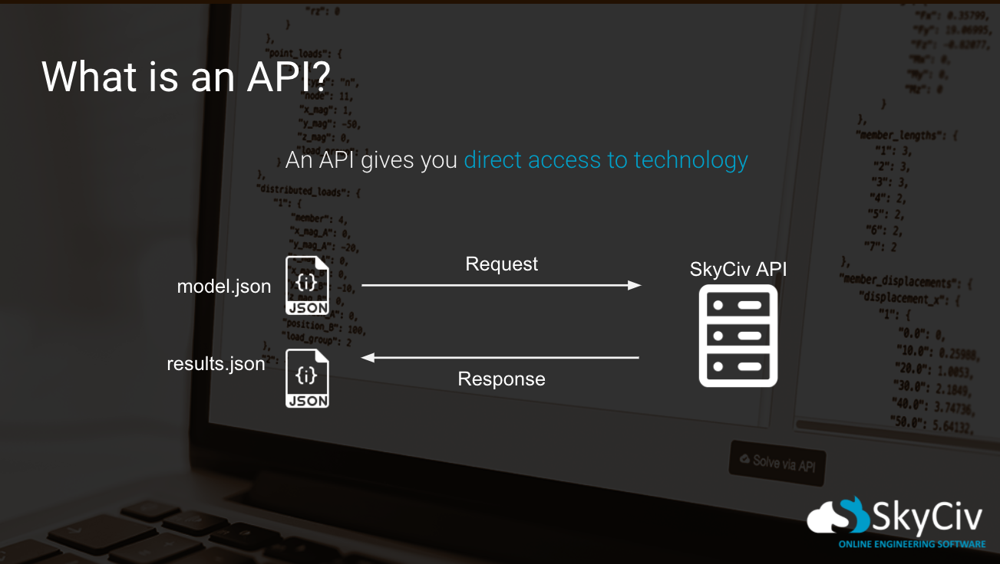

# json basics and api

## What is JSON?

JSON is an acronym for JavaScript Object Notation. It is not to be confused with an `object` or `dictionary`.

JSON was introduced as a data-exchange format. It quickly became a popular way to send data to different machines across various languages.

It is *language independent*. This means, **it doesn't belong to any language**, however, it was based on the C-family of languages.

It's easily readable for humans and very easy to "parse" for machines.

JSON can be formed using two types of structures:

- A collection of key/value pairs. Often referred to in other languages as an object, struct, dictionary, hash table, etc.
    
    e.g: `"force_type": "point_load"` 

- An ordered list of values. Often referred to in other languages as an array, list, vector, sequence, etc.
    
    e.g: `"member_ids": [1, 4, 6]` - this is guaranteed to retain the order that the values are listed.

### What does it look like?

JSON looks very similar to a JavaScript Object (essentially identical) or Python Dictionary.

Here is a small piece of JSON that we will see again in an upcoming lesson. This is a real piece of a SkyCiv API model Object

```json
{
    "plates": {
        "1": {
            "nodes": [4, 5, 7, 6],
            "thickness": 50,
            "material_id": 1,
            "rotZ": 0,
            "type": "mindlin",
            "offset": 65.6,
            "state": "stress",
            "is_meshed": true
        }
    }
}
```

A few things to note:
* The entire JSON is wrapped inside curly braces `{}`.
* Every `key` is wrapped in double quotes: `"nodes": ...`
* Every level of indentation indicates that those key-value pairs are inside the outer object.

Because `"nodes"`, `"thickness"` etc are all at the same level of indentation, this indicates that they are all inside the key `"1"` and `"1"` is a child of `"plates"`. Once you notice that the value associated to a key can be an object, then you realise that in theory, the object can go down to many sub-levels.

If we were to add another plate with an ID of `"2"`, it would be a child of the plates object.

```json
{
    "plates": {
        "1": {
            "nodes": [4, 5, 7, 6],
            "thickness": 50,
            // etc...
        },
        "2": {
            "nodes": [7, 6, 9, 8],
            "thickness": 20,
            // etc...
        }
    }
}
```

It's also important to see that we had to add a comma `","` after the first item `"1"`. This indicates we are adding more objects.

A great way to confirm you are formatting your JSON correctly is by installing the VSCode plugin "Prettier". Paste this into the search bar in the VSCode Extensions tab: `esbenp.prettier-vscode`. Prettier will format the document depending on what file type you have selected in the far bottom right of the VSCode editor. This will default to the file extension such as `.py` or `.js`.

## What is an API?
An Application Programming Interface (API) is a way of communicating with a server from any coding environment.

Think of a website that compares multiple airline prices. When you go to their website and ask: 

> Hey, I want to book a flight to this place at this time. What's the cheapest option?

where do they get all this information? Have you ever thought about this?

The answer is that every airline they check, has an API. This means the airline has set up a URL that anyone can send some data to describing their question and it will response with the requested data.

So the comparison website doesn't navigate to each website and look at the prices for your flight, instead they ask the question to the airline's API!

### SkyCiv API
So what if you wanted to solve a structural model without opening any program or website? Well you can now make a peice of data which describes a structural model and send it to the SkyCiv API! It can perform loads of actions and response with various data for you to work with.

